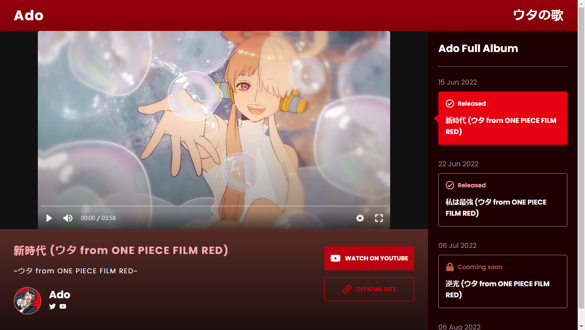

# Ado Playlist


## 💻 Project
An application to promote Ado's new album called [ウタの歌](https://www.youtube.com/playlist?list=PLaxauk3chSWhFY96tRGKJlWpTWwCb_b2M) for the movie ONE PIECE FILM RED.

You can check out a fully working version of this project [here](https://ado-playlist.vercel.app)

## 🧪 Technologies
This project was built with the following technologies:
- [React](https://reactjs.org)
- [TypeScript](https://www.typescriptlang.org/)
- [Node](https://nodejs.org/en/)

## 🔥 Setup

### Back-End:
Clone the repository, run `npm install` to install its dependencies and run `npm run dev` to start the server at localhost:4000.

```bash
git clone https://github.com/Rykasa/ado-playlist-server
npm install
npm run dev
```
### Front-End:
Clone the repository and run `npm install` to install all the dependencies.

```bash
git clone https://github.com/Rykasa/ado-playlist.git
npm install
```
Once the dependencies are installed, you can run `npm run dev` to start the application. You will then be able to access it at localhost:3000.

## 📝 License
This project is licensed under the terms of the MIT license. See [LICENSE](LICENSE) for more details.
